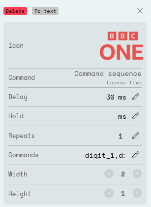

[![GitHub Release][badge_github_release_version]][github_release_link]
![GitHub Downloads (latest release)][badge_github_release_downloads]
[![GitHub Pre-release][badge_github_prerelease_version]][github_prerelease_link]
![GitHub Downloads (pre-release)][badge_github_prerelease_downloads]

# Virgin Media TiVo Integration for Remote Two

This integration is for the old software on the Virgin Media TiVo V6.

## Installation

The integration can be uploaded to the remote control or run on a separate device
on the network.

To upload on the device you can use the Web Configurator (until a stable firmware
with the functionality is released) as detailed [here](https://unfolded.community/t/can-i-upload-integrations-with-beta-1-9-4/2129/4).

## Entities Provided

### Remote

A single remote is provided per TiVo V6.

#### Available Commands

| Command | Sent using | Comments |
|---|---|---|
| Back | IRCODE | |
| Blue | IRCODE | |
| Channel Down | IRCODE | |
| Channel Up | IRCODE | |
| Clear | IRCODE | |
| Cursor Down | IRCODE | |
| Cursor Enter | IRCODE | |
| Cursor Left | IRCODE | |
| Cursor Right | IRCODE | |
| Cursor Up | IRCODE | |
| Digit 0 | IRCODE | |
| Digit 1 | IRCODE | |
| Digit 2 | IRCODE | |
| Digit 3 | IRCODE | |
| Digit 4 | IRCODE | |
| Digit 5 | IRCODE | |
| Digit 6 | IRCODE | |
| Digit 7 | IRCODE | |
| Digit 8 | IRCODE | |
| Digit 9 | IRCODE | |
| Fast Forward | IRCODE | Ensures that the next play or play/pause press should act as play |
| Green | IRCODE | |
| Guide | IRCODE | |
| Home | TELEPORT | |
| Info | IRCODE | |
| Live | TELEPORT | |
| My Recordings | TELEPORT | |
| Pause | IRCODE | |
| Play | IRCODE | |
| Play/Pause | IRCODE | Will attempt to work out whether to send a play or pause request |
| Power Off | IRCODE | Will send 2 standby commands in quick succession |
| Power On | IRCODE | |
| Previous | IRCODE | Changes to the previous channel |
| Record | IRCODE | |
| Red | IRCODE | |
| Rewind | IRCODE | Ensures that the next play or play/pause press should act as play |
| Stop | IRCODE | |
| Thumbs Down | IRCODE | |
| Thumbs Up | IRCODE | |
| Yellow | IRCODE | |

#### UI Pages

The remote allows for default pages to be created using the commands provided by
the integration.

This integration creates a number of these pages for use.

## Tips

### Favourite Channels

You can assign a button, soft or hard, to switch to a channel if you now the
channel number.

The following would switch to BBC One.



```text
Command: Command sequence
Commands: digit_1,digit_0,digit_1
```

[badge_github_release_version]: https://img.shields.io/github/v/release/uvjim/uc_virginmediativo?display_name=release&style=for-the-badge&logoSize=auto
[badge_github_release_downloads]: https://img.shields.io/github/downloads/uvjim/uc_virginmediativo/latest/total?style=for-the-badge&label=downloads%40release
[badge_github_prerelease_version]: https://img.shields.io/github/v/release/uvjim/uc_virginmediativo?include_prereleases&display_name=release&style=for-the-badge&logoSize=auto&label=pre-release
[badge_github_prerelease_downloads]: https://img.shields.io/github/downloads-pre/uvjim/uc_virginmediativo/latest/total?style=for-the-badge&label=downloads%40pre-release
[github_release_link]: https://github.com/uvjim/uc_virginmediativo/releases/latest
[github_prerelease_link]: https://github.com/uvjim/uc_virginmediativo/releases
